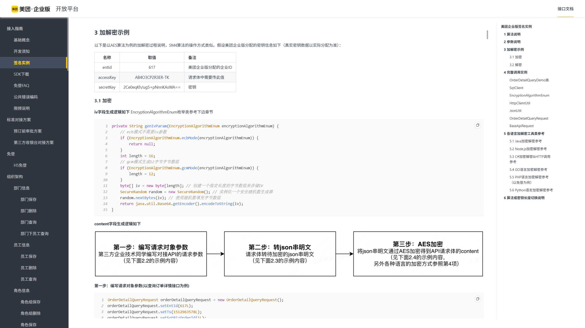
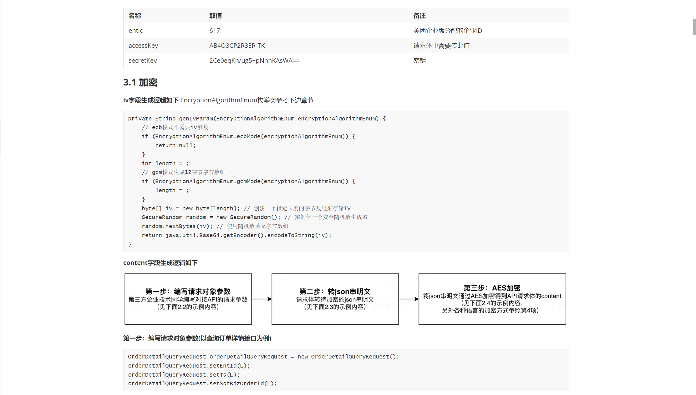

# BiSheng (毕昇)

[中文](README.md) | English

[](https://opensource.org/licenses/MIT)
[](https://www.npmjs.com/package/@curzbin/mcp-bisheng)

> **"The movable type printing for the AI era."**
> Just as movable type printing reorganized characters to spread knowledge, BiSheng reorganizes the chaotic modern web into clean, AI-friendly Markdown.

**BiSheng** is a high-performance web parsing tool built on the **Model Context Protocol (MCP)**. Designed specifically for Large Language Models (LLMs), it solves the three major challenges AI faces when accessing the modern web: **SPA Rendering**, **Token Waste**, and **Anti-bot Interception**.

### Raw HTML vs. BiSheng Markdown

| Raw Web Page | BiSheng Output |
| --- | --- |
|  |  |

## ✨ Features

* **🖥️ True Browser Rendering**: Built on Playwright (Chromium), it perfectly supports React/Vue SPAs and handles lazy loading automatically.
* **🧹 Smart Noise Reduction**: Integrated with the Readability algorithm to automatically strip ads, sidebars, and navigation, extracting only the core content.
* **📝 Clean Markdown**: Preserves code block syntax highlighting and table structures while automatically fixing relative links.
* **🛡️ Enterprise-Grade Control**: Built-in protection against SSRF (Private IP blocking), timeout controls, and resource limits.

## 🛠️ Tools

BiSheng exposes the following tools to MCP clients:

### `read_url`

Renders a web page using a headless browser and returns the main content in Markdown format. If `output_path` is provided, the content is also saved locally.

* **Parameters**:
  * `url` (string, required): The target URL (http/https only).
  * `output_path` (string, optional): The file path to save the Markdown. Relative paths are resolved from the MCP process working directory. Absolute paths are recommended.

* **Examples**:
```json
{ "url": "https://react.dev/learn" }
```

```json
{ "url": "https://example.com", "output_path": "/path/to/save/page.md" }
```

### `install_chromium`

Installs the Chromium browser required by Playwright. Use this tool if `read_url` fails due to a missing browser environment.

* **Parameters**:
  * `with_deps` (boolean, optional): Whether to install system dependencies as well. Default is `false`.

## 🚀 Quick Start

### 1. Claude Desktop (Recommended)

Add the following configuration to your `claude_desktop_config.json`:

```json
{
  "mcpServers": {
    "bisheng": {
      "command": "npx",
      "args": ["-y", "@curzbin/mcp-bisheng"]
    }
  }
}
```

In Claude, you can then ask the model and let it call the tool implicitly, or you can conceptually think of a call like:

```json
{ "tool": "read_url", "params": { "url": "https://react.dev/learn" } }
```

Claude will invoke BiSheng via MCP, get a clean Markdown view of the page, and continue answering based on that.

### 2. Using BiSheng as an MCP tool in Cursor

In Cursor, open “Settings → MCP Servers” (or the MCP configuration entry) and create a new server with the command:

```bash
{
  "mcpServers": {
    "bisheng": {
      "command": "npx",
      "args": ["-y", "@curzbin/mcp-bisheng"]
    }
  }
}
```

After saving, Cursor will launch BiSheng locally via MCP. You can then:

- **Reference a URL directly in chat**, letting Cursor call `read_url` to fetch and clean the page before answering.
- **Combine with the `output_path` parameter** to persist cleaned docs into your repo, for example:

```json
{
  "tool": "read_url",
  "params": {
    "url": "https://example.com/docs",
    "output_path": "docs/external/example-docs.md"
  }
}
```

The generated Markdown file will be indexed by Cursor, so future questions can rely on it without re-sending the whole document.

### 3. Docker

Ideal for server deployments or environments without Node.js.

```bash
docker pull curzbin/mcp-bisheng:latest

docker run --rm -i curzbin/mcp-bisheng:latest
```

### 4. CLI (Temporary Use)

```bash
npx @curzbin/mcp-bisheng
```

## ⚙️ Configuration

You can adjust BiSheng's behavior using environment variables:

| Variable | Default | Description |
| --- | --- | --- |
| `BROWSER_TIMEOUT_MS` | `30000` | Page load timeout (in milliseconds). |
| `MAX_IMAGE_RESOURCES` | `50` | Maximum number of image resources allowed per page. |
| `MCP_SERVER_NAME` | `@curzbin/mcp-bisheng` | The display name of the MCP server. |

## 🏗️ Development

This project is developed using TypeScript and Playwright.

```bash
pnpm install
pnpm dev
pnpm build
```

## ☕ Support

If this project helps you, please consider supporting my work. Your support fuels the continuous improvement and maintenance of BiSheng.

<div align="center">
<table>
<tr>
<td align="center">

</td>
<td width="50"></td>
<td align="center">

</td>
</tr>
</table>
</div>

Thank you for your support! 🙏
